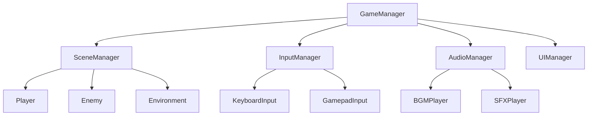

# API リファレンス

このセクションでは、ゲームエンジンの主要なクラスと関数の詳細なリファレンスを提供します。各APIの使用方法、パラメータ、戻り値、使用例を含む包括的なドキュメントです。

## 🏗️ アーキテクチャ概要

### システム構成


## 📋 クラス一覧

### コアシステム
| クラス | 説明 | 責任範囲 |
|--------|------|----------|
| [GameManager](./game-manager) | ゲーム全体の管理 | 初期化、状態管理、終了処理 |
| [SceneManager](./scene-manager) | シーン管理 | シーン読み込み、切り替え |
| [InputManager](./input-manager) | 入力処理 | キーボード、マウス、ゲームパッド |
| [AudioManager](./audio-manager) | オーディオ管理 | BGM、効果音、音量制御 |

### ゲームオブジェクト
| クラス | 説明 | 継承関係 |
|--------|------|----------|
| [Player](./player) | プレイヤーキャラクター | GameObject → Actor → Player |
| [Enemy](./enemy) | 敵キャラクター | GameObject → Actor → Enemy |
| [Projectile](./projectile) | 発射物 | GameObject → Projectile |
| [Item](./item) | アイテム | GameObject → Item |

## 🎮 基本的な使用例

### ゲーム初期化
```csharp
// ゲーム開始時の基本セットアップ
public class GameInitializer : MonoBehaviour
{
    private void Start()
    {
        // マネージャーの初期化
        GameManager.Instance.Initialize();
        InputManager.Instance.Initialize();
        AudioManager.Instance.Initialize();
        
        // 最初のシーンを読み込み
        SceneManager.Instance.LoadScene("MainMenu");
    }
}
```

### プレイヤー制御
```csharp
// プレイヤーの基本的な移動制御
public class PlayerController : MonoBehaviour
{
    private Player player;
    
    private void Start()
    {
        player = GetComponent<Player>();
    }
    
    private void Update()
    {
        // 入力取得
        Vector2 input = InputManager.Instance.GetMovementInput();
        
        // プレイヤー移動
        player.Move(input);
        
        // ジャンプ処理
        if (InputManager.Instance.GetJumpPressed())
        {
            player.Jump();
        }
        
        // 攻撃処理
        if (InputManager.Instance.GetAttackPressed())
        {
            player.Attack();
        }
    }
}
```

## 🔧 設定とカスタマイズ

### 設定ファイル例
```json
{
  "gameSettings": {
    "targetFrameRate": 60,
    "vsyncEnabled": true,
    "qualityLevel": 2
  },
  "audioSettings": {
    "masterVolume": 1.0,
    "bgmVolume": 0.8,
    "sfxVolume": 0.9
  },
  "inputSettings": {
    "mouseSensitivity": 2.5,
    "invertY": false,
    "deadzone": 0.1
  }
}
```

### カスタム設定の読み込み
```csharp
public class SettingsManager : MonoBehaviour
{
    [System.Serializable]
    public class GameSettings
    {
        public int targetFrameRate = 60;
        public bool vsyncEnabled = true;
        public int qualityLevel = 2;
    }
    
    public static GameSettings LoadSettings()
    {
        string path = Path.Combine(Application.persistentDataPath, "settings.json");
        
        if (File.Exists(path))
        {
            string json = File.ReadAllText(path);
            return JsonUtility.FromJson<GameSettings>(json);
        }
        
        return new GameSettings(); // デフォルト設定
    }
    
    public static void SaveSettings(GameSettings settings)
    {
        string path = Path.Combine(Application.persistentDataPath, "settings.json");
        string json = JsonUtility.ToJson(settings, true);
        File.WriteAllText(path, json);
    }
}
```

## 📊 パフォーマンス監視

### メトリクス取得
```csharp
public class PerformanceMetrics
{
    public static class Metrics
    {
        public static float FPS => 1.0f / Time.unscaledDeltaTime;
        public static long MemoryUsage => System.GC.GetTotalMemory(false);
        public static int DrawCalls => UnityStats.drawCalls;
        public static int Triangles => UnityStats.triangles;
    }
    
    public static void LogPerformance()
    {
        Debug.Log($"FPS: {Metrics.FPS:F1}");
        Debug.Log($"Memory: {Metrics.MemoryUsage / 1024 / 1024}MB");
        Debug.Log($"Draw Calls: {Metrics.DrawCalls}");
        Debug.Log($"Triangles: {Metrics.Triangles}");
    }
}
```

## 🐛 デバッグとテスト

### デバッグユーティリティ
```csharp
public static class DebugUtils
{
    [System.Diagnostics.Conditional("UNITY_EDITOR")]
    public static void DrawWireCube(Vector3 center, Vector3 size, Color color, float duration = 0f)
    {
        Debug.DrawLine(center + new Vector3(-size.x, -size.y, -size.z) * 0.5f,
                      center + new Vector3(size.x, -size.y, -size.z) * 0.5f, color, duration);
        // ... 他の線も描画
    }
    
    [System.Diagnostics.Conditional("DEVELOPMENT_BUILD")]
    public static void LogWarning(string message, Object context = null)
    {
        Debug.LogWarning($"[DEV] {message}", context);
    }
}
```

## 📚 詳細リファレンス

### 主要クラス
- **[GameManager](./game-manager)** - ゲーム全体の制御とライフサイクル管理
- **[Player](./player)** - プレイヤーキャラクターの制御と状態管理
- **[Enemy](./enemy)** - 敵キャラクターのAIと行動制御
- **[InputManager](./input-manager)** - 入力デバイスの統合管理
- **[AudioManager](./audio-manager)** - オーディオシステムの制御

### ユーティリティ
- **[MathUtils](./math-utils)** - 数学計算のヘルパー関数
- **[FileUtils](./file-utils)** - ファイル操作のユーティリティ
- **[NetworkUtils](./network-utils)** - ネットワーク通信のヘルパー

## 🔄 バージョン情報

### 現在のバージョン: v2.1.0

#### 新機能
- マルチプレイヤーサポート
- 改良されたAIシステム
- パフォーマンス最適化

#### 破壊的変更
- `InputManager.GetInput()` → `InputManager.GetMovementInput()`
- `AudioManager.PlaySound()` → `AudioManager.PlaySFX()`

#### 非推奨API
- `GameManager.StartGame()` - `GameManager.Initialize()` を使用してください
- `Player.SetHealth()` - `Player.Health` プロパティを使用してください

---

**使用開始**: [GameManager](./game-manager) から始めて、基本的なゲームループを理解しましょう。