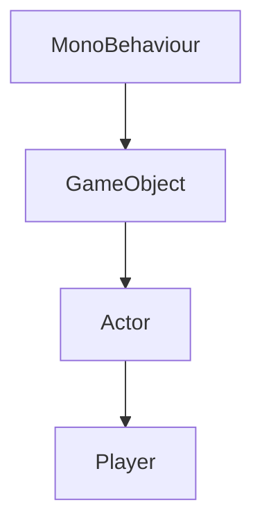

# Player クラス

`Player` クラスは、プレイヤーキャラクターの制御と状態管理を担当するコアクラスです。移動、ジャンプ、攻撃などの基本的なアクションから、ヘルス管理、アニメーション制御まで幅広い機能を提供します。

## 📋 クラス概要

```csharp
public class Player : Actor
{
    // プロパティ
    public float Health { get; set; }
    public float MaxHealth { get; private set; }
    public bool IsGrounded { get; private set; }
    public bool IsAlive => Health > 0;
    
    // イベント
    public event System.Action<float> OnHealthChanged;
    public event System.Action OnDeath;
    public event System.Action OnRespawn;
}
```

## 🏗️ 継承階層



## 🎮 主要メソッド

### Move(Vector2 direction)
プレイヤーを指定された方向に移動させます。

```csharp
public void Move(Vector2 direction)
```

**パラメータ:**
- `direction` (Vector2): 移動方向（正規化済み）

**使用例:**
```csharp
// 右に移動
player.Move(Vector2.right);

// 入力に基づく移動
Vector2 input = new Vector2(Input.GetAxis("Horizontal"), 0);
player.Move(input);
```

### Jump()
プレイヤーをジャンプさせます。地面にいる場合のみ実行されます。

```csharp
public bool Jump()
```

**戻り値:**
- `bool`: ジャンプが実行されたかどうか

**使用例:**
```csharp
if (Input.GetKeyDown(KeyCode.Space))
{
    bool jumped = player.Jump();
    if (jumped)
    {
        AudioManager.Instance.PlaySFX("jump");
    }
}
```

### Attack()
プレイヤーの攻撃アクションを実行します。

```csharp
public void Attack()
```

**使用例:**
```csharp
if (Input.GetMouseButtonDown(0))
{
    player.Attack();
}
```

### TakeDamage(float damage)
プレイヤーにダメージを与えます。

```csharp
public void TakeDamage(float damage)
```

**パラメータ:**
- `damage` (float): 与えるダメージ量

**使用例:**
```csharp
// 敵の攻撃によるダメージ
player.TakeDamage(25.0f);

// 環境ダメージ
player.TakeDamage(10.0f);
```

### Heal(float amount)
プレイヤーのヘルスを回復します。

```csharp
public void Heal(float amount)
```

**パラメータ:**
- `amount` (float): 回復量

**使用例:**
```csharp
// アイテムによる回復
player.Heal(50.0f);
```

## ⚙️ プロパティ詳細

### Health
現在のヘルス値を取得または設定します。

```csharp
public float Health { get; set; }
```

**制約:**
- 0 ≤ Health ≤ MaxHealth
- 値が変更されると `OnHealthChanged` イベントが発火

**使用例:**
```csharp
// 現在のヘルス確認
float currentHealth = player.Health;

// ヘルス設定（通常は TakeDamage や Heal を使用）
player.Health = 100.0f;
```

### MaxHealth
最大ヘルス値を取得します。

```csharp
public float MaxHealth { get; private set; }
```

**使用例:**
```csharp
// ヘルスバーの表示
float healthPercentage = player.Health / player.MaxHealth;
healthBar.fillAmount = healthPercentage;
```

### IsGrounded
プレイヤーが地面に接触しているかどうかを取得します。

```csharp
public bool IsGrounded { get; private set; }
```

**使用例:**
```csharp
// ジャンプ可能判定
if (player.IsGrounded && Input.GetKeyDown(KeyCode.Space))
{
    player.Jump();
}
```

## 📡 イベント

### OnHealthChanged
ヘルス値が変更されたときに発火します。

```csharp
public event System.Action<float> OnHealthChanged;
```

**使用例:**
```csharp
private void Start()
{
    player.OnHealthChanged += UpdateHealthUI;
}

private void UpdateHealthUI(float newHealth)
{
    healthText.text = $"HP: {newHealth:F0}";
}
```

### OnDeath
プレイヤーが死亡したときに発火します。

```csharp
public event System.Action OnDeath;
```

**使用例:**
```csharp
private void Start()
{
    player.OnDeath += HandlePlayerDeath;
}

private void HandlePlayerDeath()
{
    // ゲームオーバー処理
    GameManager.Instance.GameOver();
    
    // デスエフェクト再生
    effectManager.PlayDeathEffect(player.transform.position);
}
```

### OnRespawn
プレイヤーがリスポーンしたときに発火します。

```csharp
public event System.Action OnRespawn;
```

## 🔧 設定可能パラメータ

### Inspector設定
```csharp
[Header("Movement")]
[SerializeField] private float moveSpeed = 5.0f;
[SerializeField] private float jumpForce = 10.0f;
[SerializeField] private float airControl = 0.5f;

[Header("Combat")]
[SerializeField] private float attackDamage = 25.0f;
[SerializeField] private float attackRange = 1.5f;
[SerializeField] private float attackCooldown = 0.5f;

[Header("Health")]
[SerializeField] private float maxHealth = 100.0f;
[SerializeField] private float invulnerabilityTime = 1.0f;
```

## 💡 使用例

### 基本的なプレイヤー制御
```csharp
public class PlayerController : MonoBehaviour
{
    private Player player;
    
    private void Start()
    {
        player = GetComponent<Player>();
        
        // イベント購読
        player.OnHealthChanged += OnHealthChanged;
        player.OnDeath += OnPlayerDeath;
    }
    
    private void Update()
    {
        // 移動入力
        float horizontal = Input.GetAxis("Horizontal");
        Vector2 movement = new Vector2(horizontal, 0);
        player.Move(movement);
        
        // ジャンプ入力
        if (Input.GetKeyDown(KeyCode.Space))
        {
            player.Jump();
        }
        
        // 攻撃入力
        if (Input.GetMouseButtonDown(0))
        {
            player.Attack();
        }
    }
    
    private void OnHealthChanged(float newHealth)
    {
        // UI更新
        UIManager.Instance.UpdateHealthBar(newHealth / player.MaxHealth);
    }
    
    private void OnPlayerDeath()
    {
        // ゲームオーバー処理
        StartCoroutine(HandleGameOver());
    }
    
    private IEnumerator HandleGameOver()
    {
        // デスアニメーション待機
        yield return new WaitForSeconds(2.0f);
        
        // リスタート画面表示
        UIManager.Instance.ShowGameOverScreen();
    }
}
```

### カスタムプレイヤークラス
```csharp
public class MagicPlayer : Player
{
    [Header("Magic")]
    [SerializeField] private float mana = 100.0f;
    [SerializeField] private float maxMana = 100.0f;
    
    public float Mana => mana;
    public float MaxMana => maxMana;
    
    public event System.Action<float> OnManaChanged;
    
    public bool CastSpell(float manaCost)
    {
        if (mana >= manaCost)
        {
            mana -= manaCost;
            OnManaChanged?.Invoke(mana);
            return true;
        }
        return false;
    }
    
    protected override void Update()
    {
        base.Update();
        
        // マナ自動回復
        if (mana < maxMana)
        {
            mana = Mathf.Min(mana + Time.deltaTime * 10.0f, maxMana);
            OnManaChanged?.Invoke(mana);
        }
    }
}
```

## 🐛 トラブルシューティング

### よくある問題

**Q: プレイヤーが移動しない**
```csharp
// 確認事項
Debug.Log($"Move Speed: {moveSpeed}");
Debug.Log($"Input: {Input.GetAxis("Horizontal")}");
Debug.Log($"Rigidbody: {GetComponent<Rigidbody2D>()}");
```

**Q: ジャンプが効かない**
```csharp
// 地面判定の確認
Debug.Log($"Is Grounded: {IsGrounded}");
Debug.Log($"Jump Force: {jumpForce}");
```

**Q: ダメージが反映されない**
```csharp
// ヘルス変更の確認
Debug.Log($"Health: {Health}, Max: {MaxHealth}");
Debug.Log($"Is Invulnerable: {isInvulnerable}");
```

## 📚 関連項目

- [Enemy クラス](./enemy) - 敵キャラクターの実装
- [InputManager](./input-manager) - 入力システム
- [AudioManager](./audio-manager) - オーディオ制御
- [GameManager](./game-manager) - ゲーム状態管理