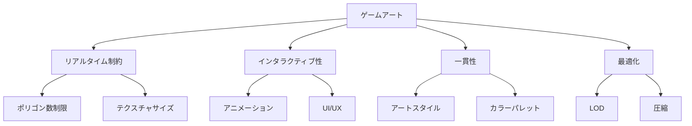
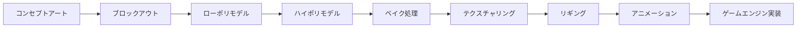

# アート制作

ゲームアートは、プレイヤーの視覚的体験を形作る重要な要素です。このセクションでは、2Dから3Dまで、ゲーム開発に必要なアート制作の技術とワークフローを解説します。

## 🎨 アート制作の基本原則

### ビジュアルデザインの要素
- **色彩理論** - 色の心理的効果と調和
- **構図** - 視線誘導と画面バランス
- **ライティング** - 雰囲気と立体感の演出
- **テクスチャ** - 質感と細部の表現

### ゲームアートの特徴


## 🖼️ 2Dアート制作

### スプライトアート
```css
/* スプライトシートの例 */
.character-idle {
    background: url('character_spritesheet.png');
    width: 64px;
    height: 64px;
    animation: idle 1s infinite;
}

@keyframes idle {
    0% { background-position: 0 0; }
    25% { background-position: -64px 0; }
    50% { background-position: -128px 0; }
    75% { background-position: -192px 0; }
    100% { background-position: 0 0; }
}
```

### ピクセルアート技法
- **制限パレット** - 色数を制限した表現
- **ドット打ち** - 1ピクセル単位での精密な作業
- **アンチエイリアシング** - ジャギーの軽減
- **ディザリング** - グラデーション表現

### 2Dアニメーション
```javascript
// フレームアニメーションの実装例
class SpriteAnimation {
    constructor(spriteSheet, frameWidth, frameHeight, frameCount) {
        this.spriteSheet = spriteSheet;
        this.frameWidth = frameWidth;
        this.frameHeight = frameHeight;
        this.frameCount = frameCount;
        this.currentFrame = 0;
        this.frameTime = 0;
        this.frameRate = 12; // FPS
    }
    
    update(deltaTime) {
        this.frameTime += deltaTime;
        if (this.frameTime >= 1 / this.frameRate) {
            this.currentFrame = (this.currentFrame + 1) % this.frameCount;
            this.frameTime = 0;
        }
    }
    
    draw(context, x, y) {
        const sourceX = this.currentFrame * this.frameWidth;
        context.drawImage(
            this.spriteSheet,
            sourceX, 0, this.frameWidth, this.frameHeight,
            x, y, this.frameWidth, this.frameHeight
        );
    }
}
```

## 🗿 3Dアート制作

### モデリング基礎
- **ローポリモデリング** - ゲーム用最適化モデル
- **ハイポリモデリング** - 詳細なディテール
- **リトポロジー** - トポロジーの最適化
- **UV展開** - テクスチャマッピング

### 3Dワークフロー


### Blenderでのモデリング例
```python
import bpy
import bmesh

# 新しいメッシュ作成
def create_game_character():
    # 既存のオブジェクトを削除
    bpy.ops.object.select_all(action='SELECT')
    bpy.ops.object.delete()
    
    # 基本形状から開始
    bpy.ops.mesh.primitive_cube_add(location=(0, 0, 1))
    
    # エディットモードに切り替え
    bpy.ops.object.mode_set(mode='EDIT')
    
    # 細分化
    bpy.ops.mesh.subdivide(number_cuts=2)
    
    # オブジェクトモードに戻る
    bpy.ops.object.mode_set(mode='OBJECT')
    
    return bpy.context.active_object

# マテリアル設定
def setup_material(obj, color=(0.8, 0.2, 0.2, 1.0)):
    mat = bpy.data.materials.new(name="CharacterMaterial")
    mat.use_nodes = True
    
    # ベースカラー設定
    bsdf = mat.node_tree.nodes["Principled BSDF"]
    bsdf.inputs[0].default_value = color
    
    # オブジェクトにマテリアル適用
    obj.data.materials.append(mat)
```

## 🎭 アニメーション制作

### キーフレームアニメーション
```csharp
// Unityでのアニメーション制御
public class CharacterAnimator : MonoBehaviour
{
    private Animator animator;
    
    [Header("Animation Parameters")]
    [SerializeField] private string walkParameter = "IsWalking";
    [SerializeField] private string speedParameter = "Speed";
    [SerializeField] private string jumpParameter = "Jump";
    
    private void Start()
    {
        animator = GetComponent<Animator>();
    }
    
    public void SetWalking(bool isWalking)
    {
        animator.SetBool(walkParameter, isWalking);
    }
    
    public void SetSpeed(float speed)
    {
        animator.SetFloat(speedParameter, speed);
    }
    
    public void TriggerJump()
    {
        animator.SetTrigger(jumpParameter);
    }
}
```

### アニメーションの原則
1. **スクワッシュ&ストレッチ** - 弾力性の表現
2. **予備動作** - 動作の予告
3. **演出** - 動作の魅力的な見せ方
4. **フォロースルー** - 残像効果
5. **スローイン・スローアウト** - 自然な加減速

## ✨ エフェクト制作

### パーティクルシステム
```csharp
// Unity パーティクルシステムの設定
public class EffectManager : MonoBehaviour
{
    [Header("Particle Systems")]
    [SerializeField] private ParticleSystem explosionEffect;
    [SerializeField] private ParticleSystem healEffect;
    [SerializeField] private ParticleSystem trailEffect;
    
    public void PlayExplosion(Vector3 position)
    {
        var effect = Instantiate(explosionEffect, position, Quaternion.identity);
        
        // パーティクル設定
        var main = effect.main;
        main.startLifetime = 2.0f;
        main.startSpeed = 5.0f;
        main.startSize = 1.0f;
        
        // 色の設定
        var colorOverLifetime = effect.colorOverLifetime;
        colorOverLifetime.enabled = true;
        
        Gradient gradient = new Gradient();
        gradient.SetKeys(
            new GradientColorKey[] { 
                new GradientColorKey(Color.yellow, 0.0f),
                new GradientColorKey(Color.red, 0.5f),
                new GradientColorKey(Color.black, 1.0f)
            },
            new GradientAlphaKey[] { 
                new GradientAlphaKey(1.0f, 0.0f),
                new GradientAlphaKey(0.0f, 1.0f)
            }
        );
        
        colorOverLifetime.color = gradient;
        
        // 自動削除
        Destroy(effect.gameObject, main.startLifetime.constant);
    }
}
```

### シェーダー効果
```hlsl
// 簡単な溶解エフェクトシェーダー
Shader "Custom/DissolveEffect"
{
    Properties
    {
        _MainTex ("Texture", 2D) = "white" {}
        _NoiseTex ("Noise Texture", 2D) = "white" {}
        _DissolveAmount ("Dissolve Amount", Range(0,1)) = 0
        _EdgeColor ("Edge Color", Color) = (1,0.5,0,1)
        _EdgeWidth ("Edge Width", Range(0,0.1)) = 0.02
    }
    
    SubShader
    {
        Tags { "RenderType"="Transparent" "Queue"="Transparent" }
        Blend SrcAlpha OneMinusSrcAlpha
        
        Pass
        {
            CGPROGRAM
            #pragma vertex vert
            #pragma fragment frag
            
            sampler2D _MainTex;
            sampler2D _NoiseTex;
            float _DissolveAmount;
            fixed4 _EdgeColor;
            float _EdgeWidth;
            
            struct appdata
            {
                float4 vertex : POSITION;
                float2 uv : TEXCOORD0;
            };
            
            struct v2f
            {
                float2 uv : TEXCOORD0;
                float4 vertex : SV_POSITION;
            };
            
            v2f vert (appdata v)
            {
                v2f o;
                o.vertex = UnityObjectToClipPos(v.vertex);
                o.uv = v.uv;
                return o;
            }
            
            fixed4 frag (v2f i) : SV_Target
            {
                fixed4 col = tex2D(_MainTex, i.uv);
                float noise = tex2D(_NoiseTex, i.uv).r;
                
                // 溶解判定
                if (noise < _DissolveAmount)
                    discard;
                
                // エッジ効果
                if (noise < _DissolveAmount + _EdgeWidth)
                {
                    col = _EdgeColor;
                }
                
                return col;
            }
            ENDCG
        }
    }
}
```

## 🛠️ 制作ツール

### 2D制作ツール
- **Photoshop** - 業界標準の画像編集
- **Aseprite** - ピクセルアート特化
- **Krita** - オープンソース描画ツール
- **Spine** - 2Dアニメーション

### 3D制作ツール
- **Blender** - オープンソース3DCG
- **Maya** - 業界標準3DCG
- **3ds Max** - 建築・ゲーム向け
- **ZBrush** - デジタルスカルプティング

### テクスチャ制作
- **Substance Painter** - 3Dペイント
- **Substance Designer** - プロシージャルテクスチャ
- **Quixel Mixer** - テクスチャブレンディング

## 📏 最適化技術

### テクスチャ最適化
```csharp
// テクスチャ圧縮設定の例
public class TextureOptimizer
{
    public static void OptimizeTexture(Texture2D texture, TextureType type)
    {
        TextureImporter importer = AssetImporter.GetAtPath(
            AssetDatabase.GetAssetPath(texture)) as TextureImporter;
        
        switch (type)
        {
            case TextureType.Diffuse:
                importer.textureCompression = TextureImporterCompression.Compressed;
                importer.compressionQuality = 50;
                break;
                
            case TextureType.Normal:
                importer.textureType = TextureImporterType.NormalMap;
                importer.textureCompression = TextureImporterCompression.Compressed;
                break;
                
            case TextureType.UI:
                importer.textureType = TextureImporterType.Sprite;
                importer.spriteImportMode = SpriteImportMode.Single;
                break;
        }
        
        importer.SaveAndReimport();
    }
}

public enum TextureType
{
    Diffuse,
    Normal,
    UI
}
```

### LOD（Level of Detail）
```csharp
// LODグループの設定
public class LODSetup : MonoBehaviour
{
    [SerializeField] private Mesh[] lodMeshes;
    [SerializeField] private float[] lodDistances = {0.6f, 0.3f, 0.1f};
    
    private void Start()
    {
        SetupLOD();
    }
    
    private void SetupLOD()
    {
        LODGroup lodGroup = gameObject.AddComponent<LODGroup>();
        LOD[] lods = new LOD[lodMeshes.Length];
        
        for (int i = 0; i < lodMeshes.Length; i++)
        {
            GameObject lodObject = new GameObject($"LOD{i}");
            lodObject.transform.SetParent(transform);
            
            MeshRenderer renderer = lodObject.AddComponent<MeshRenderer>();
            MeshFilter filter = lodObject.AddComponent<MeshFilter>();
            filter.mesh = lodMeshes[i];
            
            lods[i] = new LOD(lodDistances[i], new Renderer[] { renderer });
        }
        
        lodGroup.SetLODs(lods);
        lodGroup.RecalculateBounds();
    }
}
```

## 📚 主要トピック

### [2Dアート](./2d-art)
スプライト、ピクセルアート、2Dアニメーションの制作技法

### [3Dモデリング](./3d-modeling)
ローポリ・ハイポリモデリング、リトポロジー、UV展開

### [アニメーション](./animation)
キーフレーム、リギング、モーションキャプチャ

### [エフェクト](./effects)
パーティクル、シェーダー、ポストプロセス効果

### [ライティング](./lighting)
ライティング設計、シャドウ、アンビエント

---

**次のステップ**: [2Dアート](./2d-art) から始めて、基本的なアート制作技法を学びましょう。