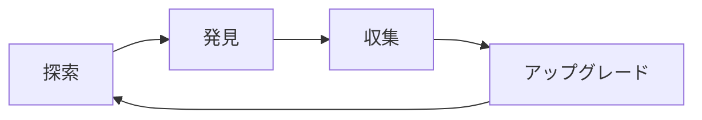
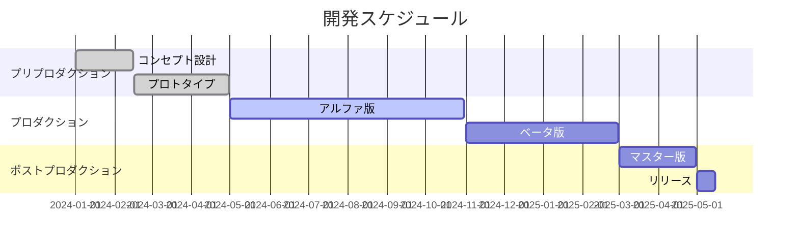

# ゲームデザイン文書（GDD）

ゲームデザイン文書（Game Design Document, GDD）は、ゲーム開発プロジェクトの設計図となる重要なドキュメントです。開発チーム全体が共通の理解を持ち、一貫した方向性でゲームを制作するための指針となります。

## 📝 GDDの目的

### 主要な目的
- **ビジョンの共有** - チーム全体で同じゴールを目指す
- **仕様の明確化** - 曖昧さを排除し、具体的な実装指針を提供
- **進捗管理** - 開発の進行状況を追跡可能にする
- **意思決定の記録** - 設計判断の根拠を文書化

### 対象読者
- プログラマー
- アーティスト
- サウンドデザイナー
- プロデューサー
- QAテスター

## 🏗️ GDDの構成要素

### 1. エグゼクティブサマリー
```markdown
## エグゼクティブサマリー

**ゲームタイトル**: スペースアドベンチャー
**ジャンル**: 3Dアクションアドベンチャー
**プラットフォーム**: PC, PlayStation 5, Xbox Series X
**ターゲット年齢**: 12歳以上
**開発期間**: 24ヶ月
**チームサイズ**: 15名

### コンセプト
宇宙を舞台にした探索型アクションゲーム。プレイヤーは宇宙船パイロットとして
未知の惑星を探索し、古代文明の謎を解き明かす。
```

### 2. ゲームプレイ概要

#### コアループ


#### 主要メカニクス
- **探索システム** - 3D空間での自由な移動
- **パズル解決** - 環境を利用した謎解き
- **リソース管理** - 燃料と酸素の管理
- **キャラクター成長** - スキルツリーによる能力向上

### 3. ゲーム世界設定

#### 世界観
- **時代設定**: 2150年の未来
- **舞台**: 銀河系外縁部の未開拓領域
- **背景**: 古代文明の遺跡が点在する謎の宙域

#### 主要キャラクター
| キャラクター | 役割 | 特徴 |
|------------|------|------|
| アレックス | 主人公 | 経験豊富な宇宙船パイロット |
| ARIA | AI助手 | 船のナビゲーションシステム |
| ドクター・チェン | 科学者 | 古代文明の専門家 |

### 4. レベル設計

#### レベル構成
1. **チュートリアル惑星** - 基本操作の習得
2. **森林惑星** - 探索メカニクスの導入
3. **砂漠惑星** - リソース管理の重要性
4. **氷河惑星** - 高難易度パズル
5. **古代遺跡** - 最終ボス戦

#### レベル設計原則
- **段階的学習** - 新しいメカニクスを徐々に導入
- **非線形進行** - プレイヤーの選択による多様なルート
- **隠し要素** - 探索を促進する秘密エリア

### 5. UI/UXデザイン

#### インターフェース要素
- **HUD** - ヘルス、燃料、酸素ゲージ
- **インベントリ** - アイテム管理システム
- **マップ** - 探索済みエリアの表示
- **スキルツリー** - キャラクター成長の可視化

#### UX原則
- **直感的操作** - 学習コストの最小化
- **視覚的フィードバック** - アクションの結果を明確に表示
- **アクセシビリティ** - 多様なプレイヤーへの配慮

## 📊 技術仕様

### エンジン・ツール
- **ゲームエンジン**: Unity 2023.3 LTS
- **3Dモデリング**: Blender, Maya
- **テクスチャ**: Substance Painter
- **オーディオ**: Wwise

### パフォーマンス目標
| プラットフォーム | 解像度 | フレームレート | ロード時間 |
|----------------|--------|---------------|-----------|
| PC (推奨) | 1920x1080 | 60 FPS | < 10秒 |
| PlayStation 5 | 3840x2160 | 60 FPS | < 8秒 |
| Xbox Series X | 3840x2160 | 60 FPS | < 8秒 |

## 🎯 マイルストーン

### 開発フェーズ


## 🔄 更新管理

### バージョン管理
- **メジャー更新** - 大幅な設計変更
- **マイナー更新** - 機能追加・修正
- **パッチ更新** - バグ修正・微調整

### 変更ログ例
```markdown
## v2.1.0 (2024-03-15)
### 追加
- 新惑星「クリスタル・ケーブ」の設計
- 協力プレイモードの仕様

### 変更
- スキルツリーの再設計
- UI配置の最適化

### 修正
- レベル3のバランス調整
- チュートリアルの改善
```

## 💡 GDD作成のベストプラクティス

### 作成時の注意点
1. **具体性** - 曖昧な表現を避け、具体的な数値や例を使用
2. **更新性** - 開発進行に合わせて継続的に更新
3. **可読性** - 図表や画像を活用して理解しやすく
4. **検索性** - 目次やタグを活用して情報を見つけやすく

### チーム協力
- **定期レビュー** - 週次でのGDD確認会議
- **フィードバック収集** - 各職種からの意見聴取
- **バージョン管理** - Gitなどでの変更履歴管理

---

**次のステップ**: [レベルデザイン](./level-design) でより詳細な設計手法を学びましょう。