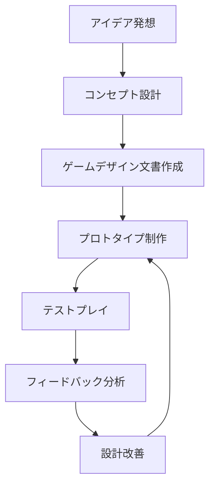

# ゲーム設計

ゲーム設計は、プレイヤーに楽しい体験を提供するための基盤となる重要な工程です。このセクションでは、ゲーム設計の基本概念から実践的な手法まで幅広くカバーします。

## 🎯 ゲーム設計の基本原則

### 1. プレイヤー中心設計
- **プレイヤーのニーズを理解する**
- **ターゲットオーディエンスの分析**
- **ユーザビリティテストの実施**

### 2. 楽しさの要素
- **チャレンジとスキルのバランス**
- **明確な目標設定**
- **適切なフィードバック**
- **プレイヤーの成長感**

### 3. ゲームメカニクス
- **コアループの設計**
- **プログレッションシステム**
- **リワードシステム**

## 📋 設計プロセス

## 🛠️ 設計ツール

### ドキュメント作成
- **Notion** - 包括的なドキュメント管理
- **Confluence** - チーム協作
- **Google Docs** - リアルタイム編集

### プロトタイピング
- **Figma** - UI/UXプロトタイプ
- **Unity** - ゲームプレイプロトタイプ
- **Construct 3** - 2Dプロトタイプ

### 分析・テスト
- **Analytics** - プレイヤー行動分析
- **A/Bテスト** - 設計の検証
- **ヒートマップ** - UI使用状況分析

## 📚 主要トピック

### [ゲームデザイン文書](./game-design-document)
ゲーム開発の設計図となる重要なドキュメントの作成方法

### [レベルデザイン](./level-design)
プレイヤーの体験を形作るレベル設計の理論と実践

### [UI/UXデザイン](./ui-ux-design)
直感的で使いやすいインターフェースの設計手法

### [バランス調整](./balancing)
ゲームの難易度とプレイヤー体験の最適化

## 💡 設計のベストプラクティス

### 反復的設計
- 早期プロトタイプの作成
- 頻繁なテストプレイ
- データに基づく改善

### チーム協力
- 定期的なデザインレビュー
- クロスファンクショナルな議論
- 明確なコミュニケーション

### プレイヤーフィードバック
- ユーザビリティテスト
- ベータテスト
- コミュニティフィードバック

## 🎮 ジャンル別設計考慮事項

### アクションゲーム
- レスポンシブな操作性
- 視覚的フィードバック
- 難易度カーブ

### RPG
- キャラクター成長システム
- ストーリー進行
- 探索要素

### パズルゲーム
- 論理的な問題設計
- 段階的な学習
- 直感的なルール

### マルチプレイヤーゲーム
- バランスの取れた競技性
- 協力メカニクス
- 社会的相互作用

---

次のステップ：[ゲームデザイン文書の作成](./game-design-document) から始めて、具体的な設計手法を学びましょう。