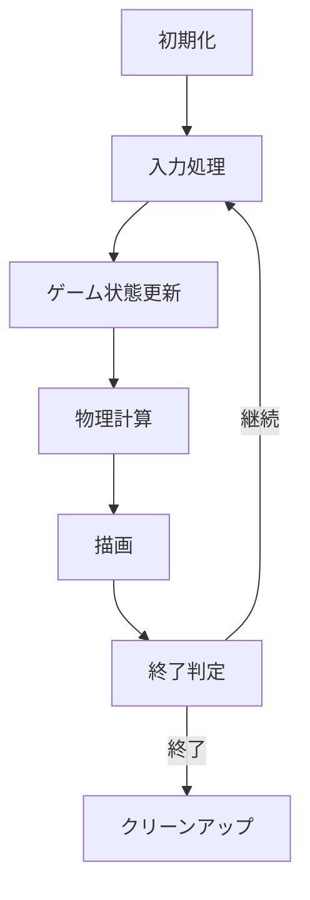

# プログラミング

ゲームプログラミングは、設計されたゲームを実際に動作するソフトウェアとして実装する技術分野です。このセクションでは、ゲーム開発に特化したプログラミング技術と実践的な実装方法を解説します。

## 🏗️ ゲームアーキテクチャの基本

### アーキテクチャパターン
- **MVC (Model-View-Controller)** - データ、表示、制御の分離
- **ECS (Entity-Component-System)** - 柔軟なオブジェクト設計
- **Observer Pattern** - イベント駆動システム
- **State Machine** - ゲーム状態管理

### コードの品質
```csharp
// 良い例：明確で保守しやすいコード
public class Player : MonoBehaviour
{
    [SerializeField] private float moveSpeed = 5.0f;
    [SerializeField] private float jumpForce = 10.0f;
    
    private Rigidbody2D rb;
    private bool isGrounded;
    
    private void Start()
    {
        rb = GetComponent<Rigidbody2D>();
    }
    
    private void Update()
    {
        HandleMovement();
        HandleJump();
    }
    
    private void HandleMovement()
    {
        float horizontal = Input.GetAxis("Horizontal");
        rb.velocity = new Vector2(horizontal * moveSpeed, rb.velocity.y);
    }
    
    private void HandleJump()
    {
        if (Input.GetKeyDown(KeyCode.Space) && isGrounded)
        {
            rb.AddForce(Vector2.up * jumpForce, ForceMode2D.Impulse);
        }
    }
}
```

## 🔄 ゲームループ

### 基本的なゲームループ


### フレームレート管理
```csharp
public class GameLoop : MonoBehaviour
{
    private const float TARGET_FPS = 60.0f;
    private const float FIXED_TIMESTEP = 1.0f / TARGET_FPS;
    
    private float accumulator = 0.0f;
    private float lastFrameTime;
    
    private void Start()
    {
        Application.targetFrameRate = (int)TARGET_FPS;
        lastFrameTime = Time.realtimeSinceStartup;
    }
    
    private void Update()
    {
        float currentTime = Time.realtimeSinceStartup;
        float deltaTime = currentTime - lastFrameTime;
        lastFrameTime = currentTime;
        
        accumulator += deltaTime;
        
        // 固定タイムステップでの更新
        while (accumulator >= FIXED_TIMESTEP)
        {
            FixedUpdate(FIXED_TIMESTEP);
            accumulator -= FIXED_TIMESTEP;
        }
        
        // 描画更新
        Render(accumulator / FIXED_TIMESTEP);
    }
}
```

## 🎮 主要システム

### 入力システム
```csharp
public class InputManager : MonoBehaviour
{
    public static InputManager Instance { get; private set; }
    
    [System.Serializable]
    public class InputBinding
    {
        public string actionName;
        public KeyCode keyCode;
        public string axisName;
    }
    
    [SerializeField] private InputBinding[] bindings;
    private Dictionary<string, InputBinding> inputMap;
    
    private void Awake()
    {
        if (Instance == null)
        {
            Instance = this;
            DontDestroyOnLoad(gameObject);
            InitializeInputMap();
        }
        else
        {
            Destroy(gameObject);
        }
    }
    
    public bool GetButtonDown(string actionName)
    {
        if (inputMap.TryGetValue(actionName, out InputBinding binding))
        {
            return Input.GetKeyDown(binding.keyCode);
        }
        return false;
    }
    
    public float GetAxis(string actionName)
    {
        if (inputMap.TryGetValue(actionName, out InputBinding binding))
        {
            return Input.GetAxis(binding.axisName);
        }
        return 0f;
    }
}
```

### オブジェクトプール
```csharp
public class ObjectPool<T> where T : MonoBehaviour
{
    private Queue<T> pool = new Queue<T>();
    private T prefab;
    private Transform parent;
    
    public ObjectPool(T prefab, int initialSize, Transform parent = null)
    {
        this.prefab = prefab;
        this.parent = parent;
        
        for (int i = 0; i < initialSize; i++)
        {
            T obj = Object.Instantiate(prefab, parent);
            obj.gameObject.SetActive(false);
            pool.Enqueue(obj);
        }
    }
    
    public T Get()
    {
        if (pool.Count > 0)
        {
            T obj = pool.Dequeue();
            obj.gameObject.SetActive(true);
            return obj;
        }
        else
        {
            return Object.Instantiate(prefab, parent);
        }
    }
    
    public void Return(T obj)
    {
        obj.gameObject.SetActive(false);
        pool.Enqueue(obj);
    }
}
```

## 🧠 AI システム

### ステートマシン
```csharp
public abstract class AIState
{
    public abstract void Enter();
    public abstract void Update();
    public abstract void Exit();
}

public class EnemyAI : MonoBehaviour
{
    private AIState currentState;
    private Dictionary<System.Type, AIState> states;
    
    private void Start()
    {
        states = new Dictionary<System.Type, AIState>
        {
            { typeof(IdleState), new IdleState(this) },
            { typeof(PatrolState), new PatrolState(this) },
            { typeof(ChaseState), new ChaseState(this) },
            { typeof(AttackState), new AttackState(this) }
        };
        
        ChangeState<IdleState>();
    }
    
    public void ChangeState<T>() where T : AIState
    {
        if (states.TryGetValue(typeof(T), out AIState newState))
        {
            currentState?.Exit();
            currentState = newState;
            currentState.Enter();
        }
    }
    
    private void Update()
    {
        currentState?.Update();
    }
}
```

## 📊 パフォーマンス最適化

### プロファイリング
```csharp
public class PerformanceProfiler : MonoBehaviour
{
    private float frameTime;
    private int frameCount;
    private float fps;
    
    private void Update()
    {
        frameTime += Time.unscaledDeltaTime;
        frameCount++;
        
        if (frameTime >= 1.0f)
        {
            fps = frameCount / frameTime;
            frameTime = 0f;
            frameCount = 0;
            
            // FPS表示やログ出力
            Debug.Log($"FPS: {fps:F1}");
        }
    }
    
    [System.Diagnostics.Conditional("UNITY_EDITOR")]
    public static void BeginSample(string name)
    {
        UnityEngine.Profiling.Profiler.BeginSample(name);
    }
    
    [System.Diagnostics.Conditional("UNITY_EDITOR")]
    public static void EndSample()
    {
        UnityEngine.Profiling.Profiler.EndSample();
    }
}
```

### メモリ管理
```csharp
public class MemoryManager : MonoBehaviour
{
    private const int GC_COLLECTION_THRESHOLD = 50; // MB
    private float lastGCTime;
    private const float GC_INTERVAL = 30.0f; // seconds
    
    private void Update()
    {
        // メモリ使用量監視
        long memoryUsage = System.GC.GetTotalMemory(false);
        float memoryMB = memoryUsage / (1024f * 1024f);
        
        // 閾値を超えた場合、または一定時間経過後にGC実行
        if (memoryMB > GC_COLLECTION_THRESHOLD || 
            Time.time - lastGCTime > GC_INTERVAL)
        {
            System.GC.Collect();
            lastGCTime = Time.time;
        }
    }
}
```

## 🛠️ 開発ツール

### デバッグシステム
```csharp
public class DebugConsole : MonoBehaviour
{
    private bool showConsole = false;
    private List<string> logs = new List<string>();
    private Vector2 scrollPosition;
    
    private void OnEnable()
    {
        Application.logMessageReceived += HandleLog;
    }
    
    private void OnDisable()
    {
        Application.logMessageReceived -= HandleLog;
    }
    
    private void HandleLog(string logString, string stackTrace, LogType type)
    {
        logs.Add($"[{type}] {logString}");
        if (logs.Count > 100) logs.RemoveAt(0);
    }
    
    private void Update()
    {
        if (Input.GetKeyDown(KeyCode.BackQuote))
        {
            showConsole = !showConsole;
        }
    }
    
    private void OnGUI()
    {
        if (!showConsole) return;
        
        GUILayout.BeginArea(new Rect(10, 10, Screen.width - 20, Screen.height / 2));
        scrollPosition = GUILayout.BeginScrollView(scrollPosition);
        
        foreach (string log in logs)
        {
            GUILayout.Label(log);
        }
        
        GUILayout.EndScrollView();
        GUILayout.EndArea();
    }
}
```

## 📚 主要トピック

### [アーキテクチャ](./architecture)
スケーラブルで保守しやすいゲームアーキテクチャの設計

### [ゲームループ](./game-loop)
効率的なゲームループとタイミング制御

### [物理エンジン](./physics)
物理シミュレーションの実装と最適化

### [AI システム](./ai-system)
ゲームAIの設計と実装手法

### [ネットワーク](./networking)
マルチプレイヤーゲームの通信システム

### [パフォーマンス最適化](./optimization)
ゲームパフォーマンスの測定と改善

## 🎯 学習ロードマップ

### 初級レベル
1. 基本的なゲームループの理解
2. オブジェクト指向プログラミング
3. Unity/Unreal Engineの基本操作

### 中級レベル
1. デザインパターンの活用
2. パフォーマンス最適化
3. AI システムの実装

### 上級レベル
1. カスタムエンジン開発
2. 高度な最適化技術
3. マルチスレッドプログラミング

---

**次のステップ**: [アーキテクチャ](./architecture) でゲームの基盤設計を学びましょう。