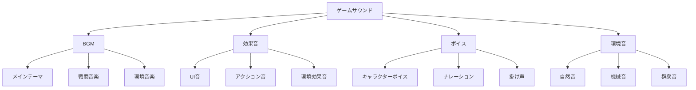

# サウンド制作

ゲームサウンドは、プレイヤーの没入感と感情的な体験を大きく左右する重要な要素です。このセクションでは、BGM、効果音、ボイスの制作から実装まで、ゲームオーディオの包括的な制作手法を解説します。

## 🎵 ゲームサウンドの基本

### オーディオの役割
- **雰囲気作り** - ゲーム世界の感情的な基調
- **フィードバック** - プレイヤーアクションの結果通知
- **情報伝達** - 視覚的に見えない情報の提供
- **没入感向上** - リアリティと臨場感の演出

### サウンドの分類


## 🎼 BGM制作

### 楽曲構成の基本
```javascript
// BGMの基本構造
const bgmStructure = {
    intro: {
        duration: "8-16 bars",
        purpose: "楽曲への導入",
        loopable: false
    },
    mainLoop: {
        duration: "16-32 bars",
        purpose: "メインメロディ",
        loopable: true
    },
    bridge: {
        duration: "8-16 bars", 
        purpose: "変化とつなぎ",
        loopable: false
    },
    outro: {
        duration: "4-8 bars",
        purpose: "楽曲の終了",
        loopable: false
    }
};
```

### ジャンル別BGM制作
```css
/* RPGフィールド音楽の特徴 */
.rpg-field-music {
    tempo: 120-140 BPM;
    key: major scales;
    instruments: strings, woodwinds, harp;
    mood: peaceful, adventurous;
    loop-length: 2-4 minutes;
}

/* アクションゲーム戦闘音楽 */
.action-battle-music {
    tempo: 140-180 BPM;
    key: minor scales;
    instruments: electric guitar, drums, brass;
    mood: intense, energetic;
    loop-length: 1-2 minutes;
}

/* ホラーゲーム環境音楽 */
.horror-ambient {
    tempo: 60-80 BPM;
    key: atonal, dissonant;
    instruments: strings, synthesizer, percussion;
    mood: tense, unsettling;
    loop-length: 3-5 minutes;
}
```

### アダプティブミュージック
```csharp
// 状況に応じて変化するBGMシステム
public class AdaptiveMusicManager : MonoBehaviour
{
    [System.Serializable]
    public class MusicLayer
    {
        public AudioSource audioSource;
        public string layerName;
        public float fadeSpeed = 1.0f;
        public bool isActive;
    }
    
    [SerializeField] private MusicLayer[] musicLayers;
    [SerializeField] private float crossfadeTime = 2.0f;
    
    private Dictionary<string, MusicLayer> layerMap;
    
    private void Start()
    {
        layerMap = new Dictionary<string, MusicLayer>();
        foreach (var layer in musicLayers)
        {
            layerMap[layer.layerName] = layer;
            layer.audioSource.volume = 0f;
            layer.audioSource.Play();
        }
    }
    
    public void SetLayerActive(string layerName, bool active)
    {
        if (layerMap.TryGetValue(layerName, out MusicLayer layer))
        {
            layer.isActive = active;
            StartCoroutine(FadeLayer(layer, active ? 1.0f : 0.0f));
        }
    }
    
    private IEnumerator FadeLayer(MusicLayer layer, float targetVolume)
    {
        float startVolume = layer.audioSource.volume;
        float elapsed = 0f;
        
        while (elapsed < crossfadeTime)
        {
            elapsed += Time.deltaTime;
            float t = elapsed / crossfadeTime;
            layer.audioSource.volume = Mathf.Lerp(startVolume, targetVolume, t);
            yield return null;
        }
        
        layer.audioSource.volume = targetVolume;
    }
    
    // ゲーム状況に応じた音楽変更
    public void OnCombatStart()
    {
        SetLayerActive("peaceful", false);
        SetLayerActive("combat", true);
        SetLayerActive("tension", true);
    }
    
    public void OnCombatEnd()
    {
        SetLayerActive("combat", false);
        SetLayerActive("tension", false);
        SetLayerActive("peaceful", true);
    }
}
```

## 🔊 効果音制作

### 効果音の分類と特徴
```javascript
const sfxCategories = {
    ui: {
        characteristics: "短い、明確、心地よい",
        examples: ["ボタンクリック", "メニュー移動", "通知音"],
        frequency: "1000-4000 Hz",
        duration: "0.1-0.5 seconds"
    },
    
    action: {
        characteristics: "インパクト、迫力、リアリティ",
        examples: ["爆発", "銃声", "剣の音"],
        frequency: "20-20000 Hz",
        duration: "0.5-3.0 seconds"
    },
    
    ambient: {
        characteristics: "持続的、背景的、雰囲気",
        examples: ["風音", "機械音", "水音"],
        frequency: "20-8000 Hz",
        duration: "loop or long"
    }
};
```

### プロシージャル効果音生成
```csharp
// 簡単な効果音ジェネレーター
public class SFXGenerator : MonoBehaviour
{
    [Header("Wave Settings")]
    [SerializeField] private int sampleRate = 44100;
    [SerializeField] private float duration = 1.0f;
    
    public AudioClip GenerateExplosion()
    {
        int sampleCount = Mathf.RoundToInt(sampleRate * duration);
        float[] samples = new float[sampleCount];
        
        for (int i = 0; i < sampleCount; i++)
        {
            float t = (float)i / sampleCount;
            
            // ノイズベース
            float noise = Random.Range(-1f, 1f);
            
            // エンベロープ（減衰）
            float envelope = Mathf.Exp(-t * 5f);
            
            // ローパスフィルター効果
            float frequency = Mathf.Lerp(200f, 50f, t);
            float wave = Mathf.Sin(2 * Mathf.PI * frequency * t);
            
            samples[i] = (noise * 0.7f + wave * 0.3f) * envelope;
        }
        
        AudioClip clip = AudioClip.Create("Explosion", sampleCount, 1, sampleRate, false);
        clip.SetData(samples, 0);
        return clip;
    }
    
    public AudioClip GeneratePickup()
    {
        int sampleCount = Mathf.RoundToInt(sampleRate * 0.3f);
        float[] samples = new float[sampleCount];
        
        for (int i = 0; i < sampleCount; i++)
        {
            float t = (float)i / sampleCount;
            
            // 上昇する音程
            float frequency = Mathf.Lerp(440f, 880f, t);
            float wave = Mathf.Sin(2 * Mathf.PI * frequency * t);
            
            // エンベロープ
            float envelope = Mathf.Sin(Mathf.PI * t);
            
            samples[i] = wave * envelope * 0.5f;
        }
        
        AudioClip clip = AudioClip.Create("Pickup", sampleCount, 1, sampleRate, false);
        clip.SetData(samples, 0);
        return clip;
    }
}
```

### 3Dオーディオ実装
```csharp
// 3D空間でのオーディオ管理
public class Audio3DManager : MonoBehaviour
{
    [System.Serializable]
    public class AudioZone
    {
        public string zoneName;
        public AudioClip ambientClip;
        public float volume = 1.0f;
        public float fadeDistance = 10.0f;
        public Transform center;
        public float radius = 20.0f;
    }
    
    [SerializeField] private AudioZone[] audioZones;
    [SerializeField] private Transform listener; // プレイヤー
    
    private Dictionary<string, AudioSource> zoneSources;
    
    private void Start()
    {
        zoneSources = new Dictionary<string, AudioSource>();
        
        foreach (var zone in audioZones)
        {
            GameObject sourceObj = new GameObject($"AudioZone_{zone.zoneName}");
            sourceObj.transform.position = zone.center.position;
            
            AudioSource source = sourceObj.AddComponent<AudioSource>();
            source.clip = zone.ambientClip;
            source.loop = true;
            source.spatialBlend = 1.0f; // 3D
            source.rolloffMode = AudioRolloffMode.Linear;
            source.maxDistance = zone.radius;
            source.volume = 0f;
            source.Play();
            
            zoneSources[zone.zoneName] = source;
        }
    }
    
    private void Update()
    {
        foreach (var zone in audioZones)
        {
            float distance = Vector3.Distance(listener.position, zone.center.position);
            float volumeMultiplier = 1.0f - Mathf.Clamp01(distance / zone.radius);
            
            if (zoneSources.TryGetValue(zone.zoneName, out AudioSource source))
            {
                source.volume = zone.volume * volumeMultiplier;
            }
        }
    }
}
```

## 🎤 ボイス制作

### ボイス録音の基本
```markdown
## 録音環境設定

### 必要機材
- **マイクロフォン**: コンデンサーマイク（感度良好）
- **オーディオインターフェース**: 24bit/48kHz以上
- **ヘッドフォン**: モニター用クローズド型
- **防音**: 吸音材、リフレクションフィルター

### 録音設定
- **サンプルレート**: 48kHz（ゲーム標準）
- **ビット深度**: 24bit（編集用）
- **フォーマット**: WAV（非圧縮）
- **レベル**: -12dB to -6dB（ピーク）
```

### ボイス処理パイプライン
```csharp
// ボイス処理システム
public class VoiceProcessor : MonoBehaviour
{
    [Header("Voice Effects")]
    [SerializeField] private AudioReverbFilter reverbFilter;
    [SerializeField] private AudioLowPassFilter lowPassFilter;
    [SerializeField] private AudioHighPassFilter highPassFilter;
    
    [Header("Character Voice Settings")]
    [SerializeField] private VoiceProfile[] characterVoices;
    
    [System.Serializable]
    public class VoiceProfile
    {
        public string characterName;
        public float pitch = 1.0f;
        public float reverbLevel = 0.0f;
        public float lowPassCutoff = 22000f;
        public float highPassCutoff = 10f;
        public AudioClip[] voiceClips;
    }
    
    public void PlayCharacterVoice(string characterName, int clipIndex)
    {
        VoiceProfile profile = System.Array.Find(characterVoices, 
            v => v.characterName == characterName);
        
        if (profile != null && clipIndex < profile.voiceClips.Length)
        {
            AudioSource source = GetComponent<AudioSource>();
            source.clip = profile.voiceClips[clipIndex];
            source.pitch = profile.pitch;
            
            // エフェクト適用
            ApplyVoiceEffects(profile);
            
            source.Play();
        }
    }
    
    private void ApplyVoiceEffects(VoiceProfile profile)
    {
        if (reverbFilter != null)
        {
            reverbFilter.reverbLevel = profile.reverbLevel;
        }
        
        if (lowPassFilter != null)
        {
            lowPassFilter.cutoffFrequency = profile.lowPassCutoff;
        }
        
        if (highPassFilter != null)
        {
            highPassFilter.cutoffFrequency = profile.highPassCutoff;
        }
    }
}
```

## 🛠️ 制作ツール

### DAW（Digital Audio Workstation）
- **Reaper** - 軽量で高機能、ゲーム開発向け
- **Pro Tools** - 業界標準、プロ仕様
- **Logic Pro** - Mac専用、直感的操作
- **Cubase** - 総合的な音楽制作

### 効果音制作ツール
- **Audacity** - 無料、基本的な編集
- **Adobe Audition** - 高度な音声編集
- **FMOD Studio** - ゲーム特化オーディオツール
- **Wwise** - インタラクティブオーディオ

### プラグイン・ライブラリ
```javascript
// 推奨オーディオプラグイン
const recommendedPlugins = {
    synthesis: [
        "Serum", "Massive X", "Omnisphere"
    ],
    effects: [
        "FabFilter Pro-Q 3", "Waves SSL", "Soundtoys"
    ],
    mastering: [
        "Ozone", "T-RackS", "Pro-L 2"
    ],
    gameAudio: [
        "FMOD", "Wwise", "Unity Audio Mixer"
    ]
};
```

## 📊 オーディオ最適化

### ファイル形式と圧縮
```csharp
// オーディオ圧縮設定
public class AudioOptimizer
{
    public static void OptimizeAudioClip(AudioClip clip, AudioType type)
    {
        string path = AssetDatabase.GetAssetPath(clip);
        AudioImporter importer = AssetImporter.GetAtPath(path) as AudioImporter;
        
        switch (type)
        {
            case AudioType.BGM:
                importer.compressionFormat = AudioCompressionFormat.Vorbis;
                importer.quality = 0.7f; // 70%品質
                importer.loadType = AudioClipLoadType.Streaming;
                break;
                
            case AudioType.SFX:
                importer.compressionFormat = AudioCompressionFormat.ADPCM;
                importer.loadType = AudioClipLoadType.DecompressOnLoad;
                break;
                
            case AudioType.Voice:
                importer.compressionFormat = AudioCompressionFormat.Vorbis;
                importer.quality = 0.5f; // 50%品質
                importer.loadType = AudioClipLoadType.CompressedInMemory;
                break;
        }
        
        importer.SaveAndReimport();
    }
}

public enum AudioType
{
    BGM,
    SFX,
    Voice
}
```

### メモリ管理
```csharp
// オーディオメモリプール
public class AudioPool : MonoBehaviour
{
    [SerializeField] private int poolSize = 10;
    [SerializeField] private AudioSource audioSourcePrefab;
    
    private Queue<AudioSource> availableSources;
    private List<AudioSource> allSources;
    
    private void Start()
    {
        availableSources = new Queue<AudioSource>();
        allSources = new List<AudioSource>();
        
        for (int i = 0; i < poolSize; i++)
        {
            AudioSource source = Instantiate(audioSourcePrefab, transform);
            source.gameObject.SetActive(false);
            availableSources.Enqueue(source);
            allSources.Add(source);
        }
    }
    
    public AudioSource GetAudioSource()
    {
        if (availableSources.Count > 0)
        {
            AudioSource source = availableSources.Dequeue();
            source.gameObject.SetActive(true);
            return source;
        }
        
        // プールが空の場合、新しく作成
        AudioSource newSource = Instantiate(audioSourcePrefab, transform);
        allSources.Add(newSource);
        return newSource;
    }
    
    public void ReturnAudioSource(AudioSource source)
    {
        source.Stop();
        source.clip = null;
        source.gameObject.SetActive(false);
        availableSources.Enqueue(source);
    }
}
```

## 📚 主要トピック

### [BGM制作](./bgm)
楽曲制作、アダプティブミュージック、ループ設計

### [効果音](./sfx)
効果音制作、プロシージャル生成、3Dオーディオ

### [ボイス](./voice)
ボイス録音、処理、実装技術

### [実装](./implementation)
ゲームエンジンでのオーディオシステム実装

---

**次のステップ**: [BGM制作](./bgm) から始めて、ゲーム音楽の基礎を学びましょう。